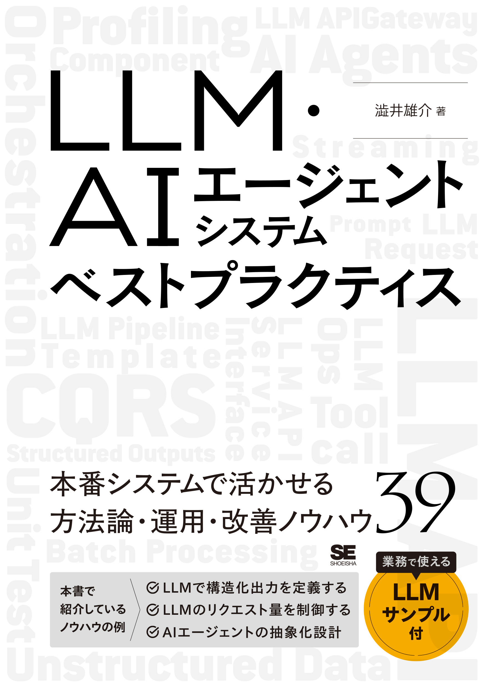

# llm-best-practice-book-program

このレポジトリは翔泳社刊『[LLM・AIエージェントシステムベストプラクティス](https://www.shoeisha.co.jp/book/detail/9784798194318)』のためのコード例をまとめたものです。

## 書籍について

## プログラムについて

このレポジトリには、書籍内で紹介されているプラクティスのコード例が含まれています。各章ごとにディレクトリが分かれており、対応するコード例が格納されています。

コード例はPythonで書かれており、必要に応じて依存関係をインストールして実行できます。各ディレクトリ内のREADMEファイルには、コード例の説明と実行方法が記載されています。

なお、Pythonのライブラリ管理には [uv](https://docs.astral.sh/uv/) を使用しています。各章のディレクトリに `pyproject.toml` と `uv.lock` ファイルが含まれており、これらを使って依存関係をインストールできます。

また、一部のコード例には [Docker](https://www.docker.com/ja-jp/) および [Docker Compose](https://docs.docker.com/compose/) が使用されています。Dockerを使用することで、環境構築が容易になり、コード例をすぐに実行できます。

それぞれのライブラリは自らの環境に合わせてインストールしてください。

### LLMの利用について

各コード例ではLLM（大規模言語モデル）を利用したプログラムを提供しています。このレポジトリでは、すべてのLLM呼び出しを [Amazon Bedrock](https://aws.amazon.com/jp/bedrock/) 経由で行うように変更しています。

- Anthropic Claude: `anthropic` SDK のBedrock用クライアント（`AnthropicBedrock`）で呼び出します。モデルは Claude Sonnet 4.6 / Claude Haiku 4.5 です。
- OpenAI GPT: `openai` SDK の接続先をBedrockのOpenAI互換エンドポイントに向けて呼び出します。モデルは GPT-5.5 / GPT-5.4 です。
- 埋め込み: Amazon Titan Text Embeddings V2 を使います。
- Google Gemini: Bedrockでは提供されていないため、Geminiを使っていたコードはClaudeに書き換えるか、コメントアウトしています。

APIキーは不要で、AWSの認証情報（`~/.aws/credentials` または `AWS_ACCESS_KEY_ID` などの環境変数）を使います。リージョンは環境変数 `AWS_REGION` で指定し、未指定の場合は `us-east-1` を使います（OpenAIのGPTモデルは `us-east-1` など一部のリージョンでのみ提供されています）。事前にBedrockのコンソールで利用するモデルへのアクセスを有効にしてください。

なお、[第2章 第5項 非同期バッチ処理](./chapter_2/section_5) は、各社のバッチAPIに相当するものがBedrockのSDK経由では提供されていないため、通常のリクエストを並列実行する実装に置き換えています（ジョブの受付・キュー・ワーカーの構成は元のままです）。

Bedrockの利用には料金がかかります。料金については [Amazon Bedrock の料金](https://aws.amazon.com/jp/bedrock/pricing/) を確認してください。

本プロジェクトおよびLLM APIの利用は自己責任で行ってください。

## 目次

- 第2章 LLMをソフトウェアに組み込む基礎的なプラクティス
  - [第1項 LLMの出力を構造化する](./chapter_2/section_1)
  - [第2項 LLMで構造化出力を定義する](./chapter_2/section_2)
  - [第3項 非構造化データの構造化](./chapter_2/section_3)
  - [第4項 LLMOpsのための構造化ログ](./chapter_2/section_4)
  - [第5項 非同期バッチ処理](./chapter_2/section_5)
  - [第6項 LLM出力をストリーミングにする](./chapter_2/section_6)
  - [第7項 LLMでLLMを評価する](./chapter_2/section_7)
  - [第8項 プロンプトを構造的にテンプレート化する](./chapter_2/section_8)
  - [第9項 プロンプトのユニットテスト](./chapter_2/section_9)
  - [第10項 プロンプトパフォーマンスのプロファイリング](./chapter_2/section_10)
  - [第11項 関数呼び出し（Tool call）と外部サービス活用](./chapter_2/section_11)
  - [第12項 LLMによるスクリプト生成と実行](./chapter_2/section_12)

- 第3章 LLMのAPIを活用するプラクティス
  - [第1項 LLM APIのためのAdaptorとFactoryパターン](./chapter_3/section_1)
  - [第2項 LLMリクエストのタイムアウトとフォールバック](./chapter_3/section_2)
  - [第3項 LLMリクエストの適応的バックオフによるリトライ](./chapter_3/section_3)
  - [第4項 LLMのリクエスト量を制御する](./chapter_3/section_4)
  - [第5項 LLM APIゲートウェイ](./chapter_3/section_5)

- 第4章 LLMのパイプラインやエージェントプラクティス
  - [第1項 状態変化と読み取りの責任分離（LLMシステムのCQRS）](./chapter_4/section_1)
  - [第2項 LLMサービスインターフェイスの分離](./chapter_4/section_2)
  - [第3項 LLMシステムを機能単位の部品に分離する](./chapter_4/section_3)
  - [第4項 LLMパイプライン](./chapter_4/section_4)
  - [第5項 LLMワークフローのためのオーケストレーション](./chapter_4/section_5)
  - [第6項 LLMパイプラインのための依存性注入](./chapter_4/section_6)
  - [第7項 AIエージェントの抽象化設計](./chapter_4/section_7)
  - [第8項 安定したコア機能と柔軟な拡張機能](./chapter_4/section_8)

- 第5章 AIエージェント設計のプラクティス
  - [第1項 ReAct型AIエージェント](./chapter_5/section_1)
  - [第2項 マルチAIエージェント](./chapter_5/section_2)
  - [第3項 多層型AIエージェント](./chapter_5/section_3)
  - [第4項 パイプライン型AIエージェント](./chapter_5/section_4)
  - [第5項 イベント駆動型AIエージェント](./chapter_5/section_5)
  - [第6項 学習型AIエージェント](./chapter_5/section_6)
  - 第7項 AIエージェントをソフトウェアに組み込む(サンプル実装なし)

- 第6章 応用的なプラクティス
  - [第1項 LLMを安定して使うために自由度を下げる](./chapter_6/section_1)
  - [第2項 LLM SDKの薄いラッパーライブラリ](./chapter_6/section_2)
  - [第3項 複数推論と候補評価](./chapter_6/section_3)
  - [第4項 不要な過去を忘れ、やり直し、未来を作る](./chapter_6/section_4)
  - [第5項 関数呼び出しのエンジニアリング](./chapter_6/section_5)
  - [第6項 関数呼び出しのtool chain](./chapter_6/section_6)
  - [第7項 AIエージェントのメモリ更新戦略](./chapter_6/section_7)

